# 📸 Locket Upload - React Native
Ứng dụng **Locket Upload** (bản tùy chỉnh của Locket Clone) giúp bạn tải ảnh lên **Locket Camera** một cách nhanh chóng và dễ dàng. Với giao diện thân thiện và tính năng thông minh, đây là công cụ lý tưởng để bạn chia sẻ khoảnh khắc với người thân và bạn bè ngay trên màn hình chính của họ.

## ✨ Tính năng nổi bật

- ✂️ **Cắt ảnh**: Đảm bảo ảnh đúng tỉ lệ 1:1 trước khi tải lên để phù hợp với giao diện Locket.
- 📤 **Hiển thị tiến trình tải ảnh**: Theo dõi trực quan quá trình upload.
- 🖼️ **Xem trước ảnh**: Có thể xem lại trước khi xác nhận gửi.
- 🔄 **Đổi tên người dùng**: Cá nhân hóa tên hiển thị trong ứng dụng.
- 🧑‍🤝‍🧑 **Hiển thị danh sách bạn bè**: Xem và chọn người nhận trước khi upload.
- 🕰️ **Xem lại các moment cũ**: Dễ dàng xem lại những khoảnh khắc đã lưu trữ. (Lưu ý: Backend API cho tính năng này hiện là placeholder)
- 💬 **Reaction các moment của bạn bè**: Thể hiện cảm xúc với moment của người khác. (Lưu ý: Backend API cho tính năng này hiện là placeholder)
- 🚀 **Cập nhật trong app**: Nhận bản cập nhật mới ngay trong ứng dụng, không cần tải APK thủ công. (Tính năng này có thể cần cấu hình phía server cho việc kiểm tra cập nhật)

## 📦 Bản dựng sẵn

(Phần này được giữ nguyên từ README gốc, người dùng dự án có thể cần cập nhật nếu họ tự quản lý bản dựng)
Bản dựng sẵn có thể tải [Tại đây](https://github.com/quockhanh2004/locket_upload_react_native/releases)

[](https://github.com/quockhanh2004/locket_upload_react_native/releases)

## 📷 Hình ảnh minh họa
<details>
  <summary>Xem hình ảnh minh họa (nhấn để mở)</summary>

  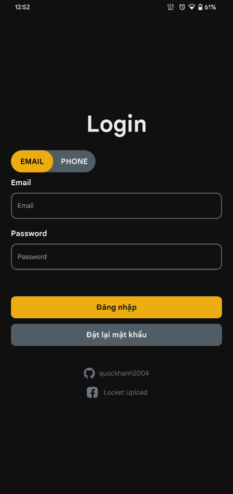  
  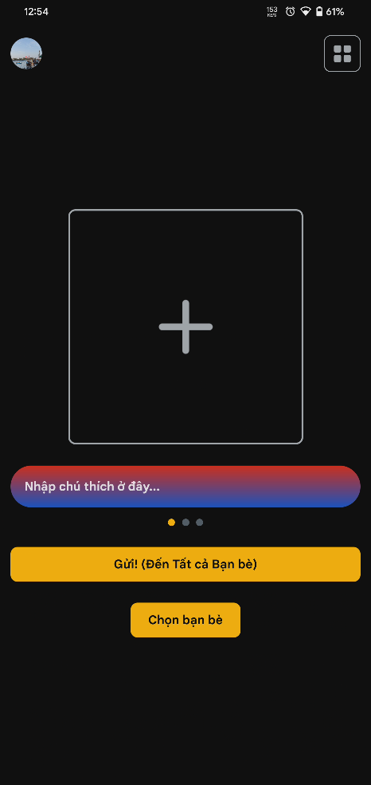  
  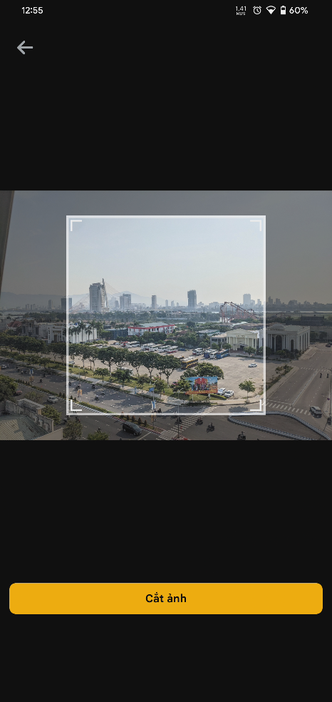  
  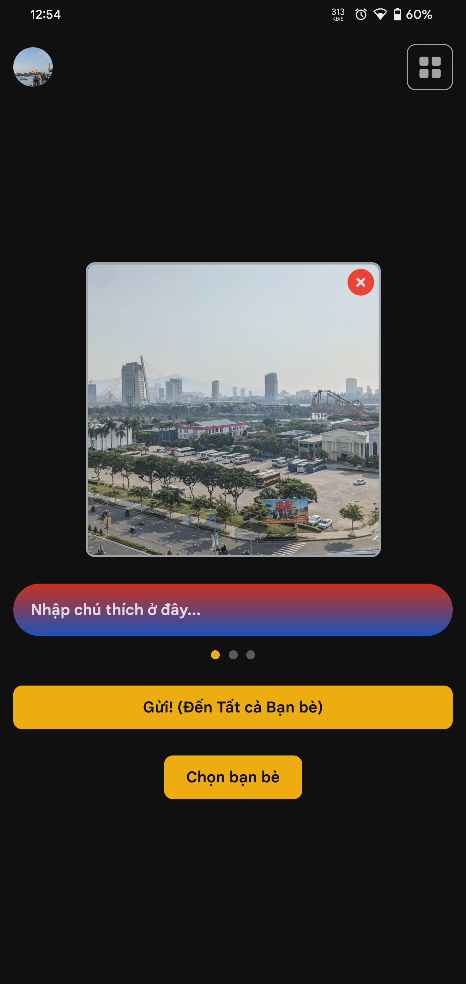  
  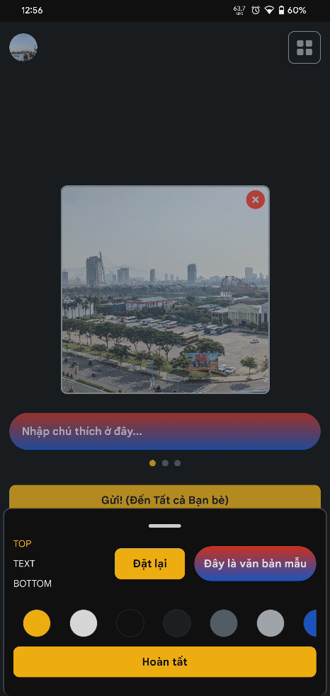  
  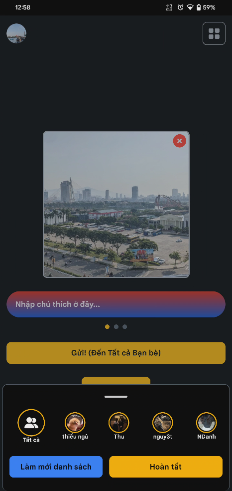  
  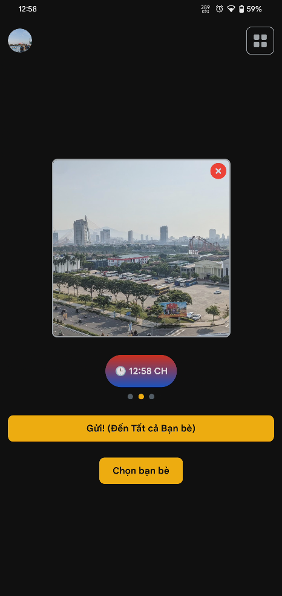  
  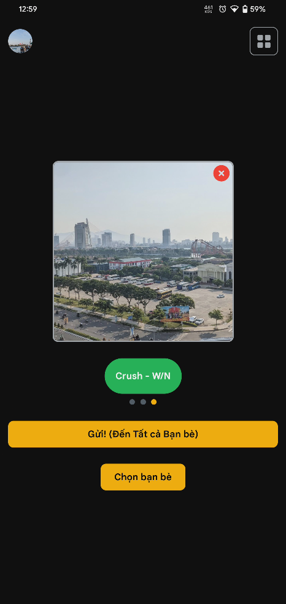  
  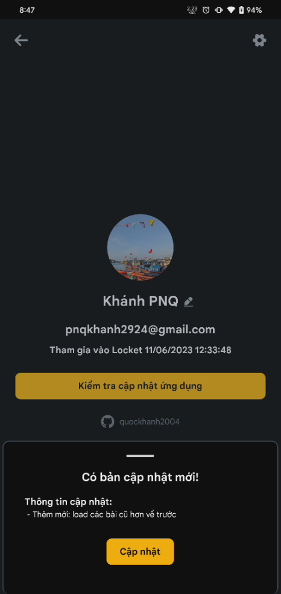  
  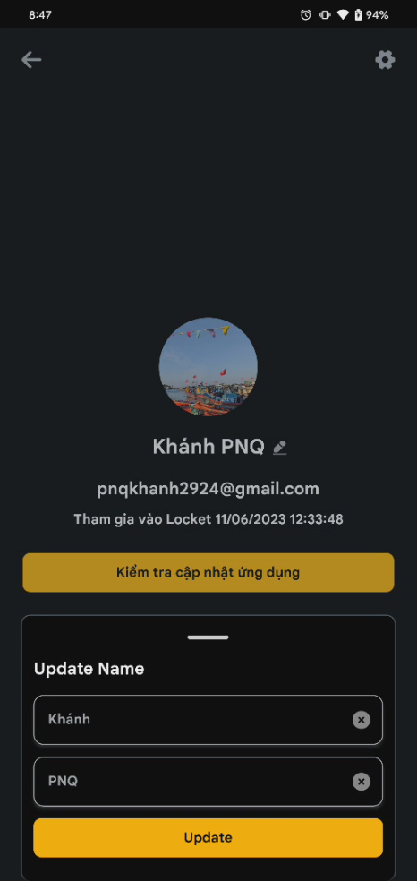  
  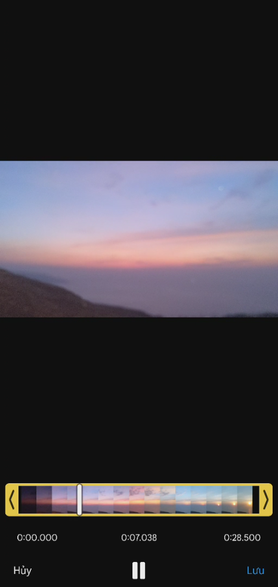  
  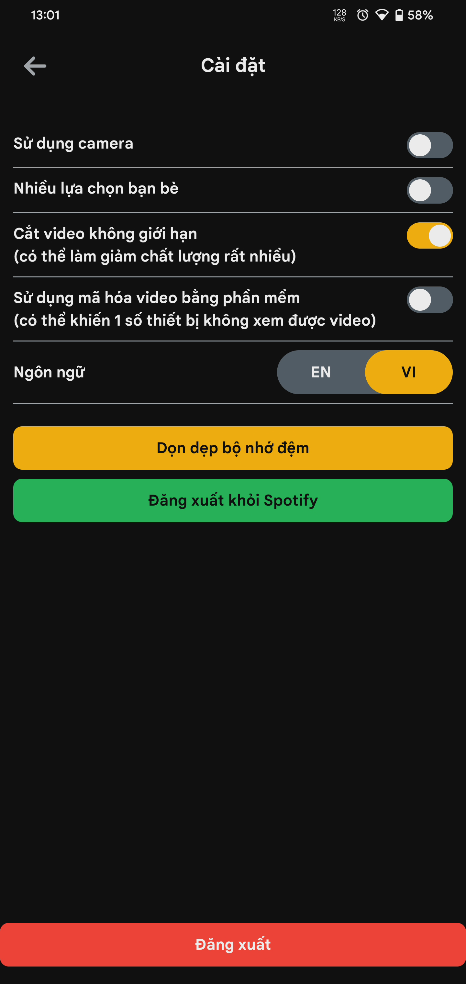  
  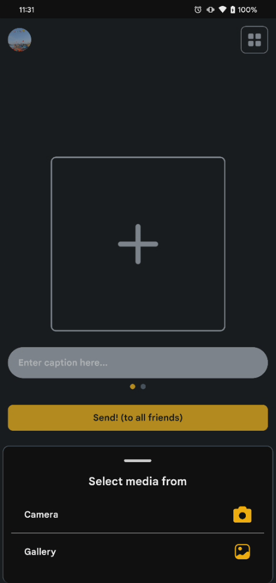  
  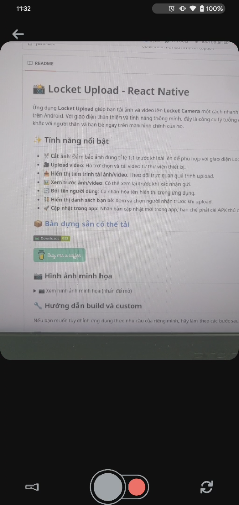  
  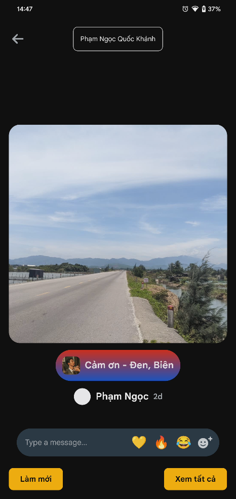  
  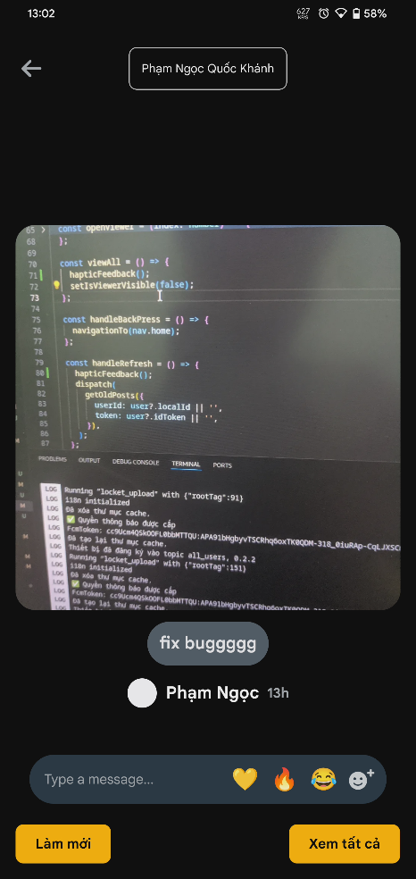  

</details>

## 🔧 Hướng dẫn build và custom

Nếu bạn muốn tùy chỉnh ứng dụng theo nhu cầu của riêng mình, hãy làm theo các bước sau:

### 1️⃣ Cài đặt môi trường

Trước tiên, hãy đảm bảo bạn đã cài đặt:

- **Node.js** (>= 18)
- **npm**
- **Expo CLI** (`npm install -g expo-cli`)
- **EAS CLI** (nếu sử dụng Expo Application Services: `npm install -g eas-cli`)
- **Android Studio** (cho development build trên Android emulator/device)
- **Xcode** (cho development build trên iOS simulator/device)
- **Đổi tên file `.env.examble` thành `.env`** (Lưu ý: tên file gốc là `.env.examble`) và cập nhật các biến môi trường cần thiết.
- **Thiết lập Firebase:**
    - Đặt file `google-services.json` (Android) vào thư mục `android/app/` (nếu bạn build native code hoặc sử dụng EAS Build). Đối với Expo Go hoặc development builds được quản lý bởi Expo, cấu hình Firebase thường được thực hiện trong `app.json` hoặc thông qua các plugin Expo. Tuy nhiên, do dự án này sử dụng `@react-native-firebase`, việc đặt file này là cần thiết cho các bản build native.
    - Đặt file `GoogleService-Info.plist` (iOS) vào thư mục `ios/locket_upload/` (tên thư mục con có thể thay đổi tùy theo cấu trúc dự án iOS).

### 2️⃣ Clone repo

```sh
git clone https://github.com/quockhanh2004/locket_upload_react_native.git
cd locket_upload_react_native # Hoặc tên thư mục dự án của bạn
npm install
```

### 3️⃣ Cài đặt dependencies

```sh
npm install
```

### 4️⃣ Chạy ứng dụng (Development)

Để chạy ứng dụng trong môi trường phát triển, bạn cần một development build trên thiết bị hoặc emulator/simulator.

**Tạo Development Build (nếu chưa có):**
Sử dụng EAS CLI (Expo Application Services):
```sh
# Cài đặt EAS CLI nếu chưa có: npm install -g eas-cli
# Đăng nhập vào tài khoản Expo: eas login
eas build -p android --profile development
# hoặc
eas build -p ios --profile development
```
Sau đó cài đặt file build (`.apk` hoặc `.tar.gz`) lên thiết bị/emulator.

**Chạy Development Server:**
```sh
npx expo start --dev-client
```
Quét mã QR từ terminal bằng ứng dụng Expo Go trên thiết bị của bạn (nếu build tương thích với Expo Go) hoặc development build đã cài đặt.

### 5️⃣ Build ứng dụng cho Production

Để tạo bản build production cho việc phát hành:
```sh
# Android
eas build -p android --profile production

# iOS
eas build -p ios --profile production
```
File build sẽ được tạo bởi EAS và có thể tải về từ dashboard Expo.

### 6️⃣ Tuỳ chỉnh theo ý muốn

Bạn có thể thay đổi các thành phần trong source code, chẳng hạn:
- **Giao diện**: `src/components/`, `src/Dialog/`, `src/screen/`
- **API Integration**: `src/redux/action/postMoment.action.tsx` (hiện tại trỏ đến API placeholder).

**Lưu ý quan trọng về Backend API:**
Backend của dự án này hiện tại đang ở trạng thái **placeholder**.
- Endpoint chính để tạo "moment" (chia sẻ ảnh) là `POST /api/v1/moments`. Frontend sẽ tải ảnh lên Firebase Storage (cần bạn tự cấu hình Firebase) và gửi `thumbnail_url` cùng với thông tin người nhận và hiệu ứng đến endpoint này. Endpoint này hiện chỉ trả về thông báo thành công giả lập.
- Tất cả các API backend khác (xác thực, quản lý người dùng, bạn bè, lịch sử ảnh, v.v.) cũng là placeholder. Chúng sẽ trả về dữ liệu giả lập và **cần người dùng tự hoàn thiện** để ứng dụng hoạt động đầy đủ với cơ sở dữ liệu và các dịch vụ cần thiết khác. Tham khảo `README.md` ở thư mục gốc và `backend/README.md` để biết thêm chi tiết.

## 🚀 Đóng góp

<p align="left">
  <a href="https://buymeacoffee.com/quockhanh2004" target="_blank">
    
  </a>
</p>

<p align="left">
    
</p>

Nếu bạn có ý tưởng hoặc muốn cải thiện ứng dụng, hãy tạo **Pull Request** trên GitHub!

📌 **Repo chính thức:** [GitHub - quockhanh2004/locket_upload_react_native](https://github.com/quockhanh2004/locket_upload_react_native)

---

📢 Nếu thấy hữu ích, hãy ⭐ repo nhé! 😍
